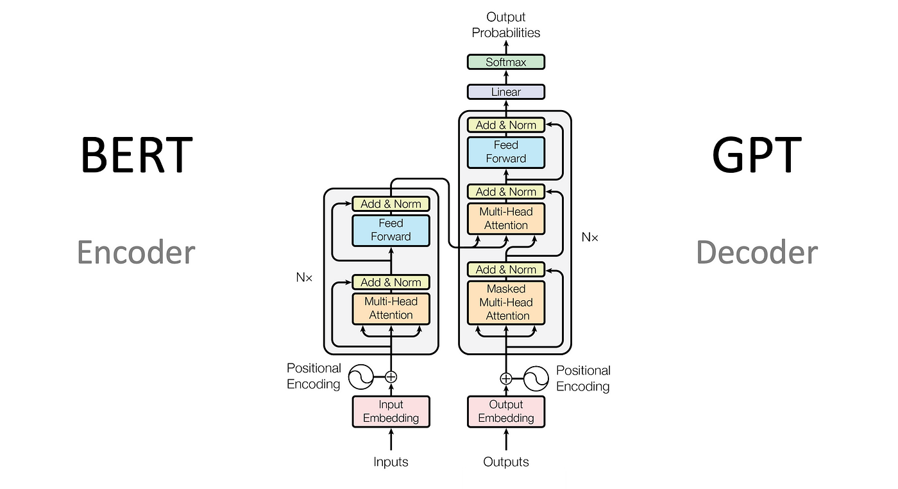
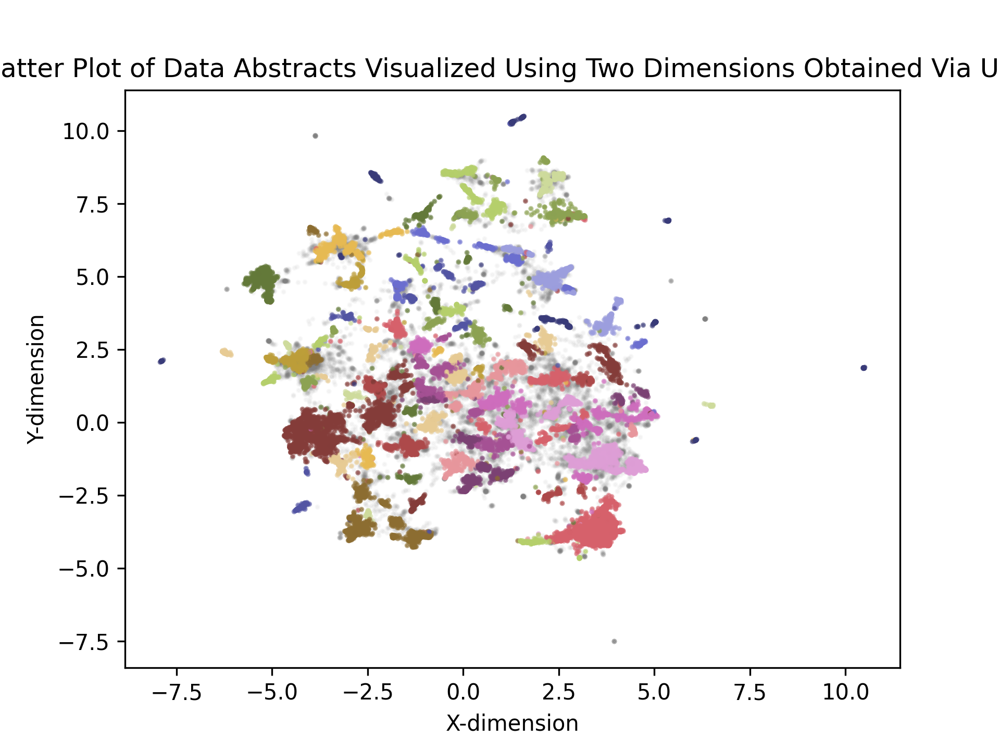
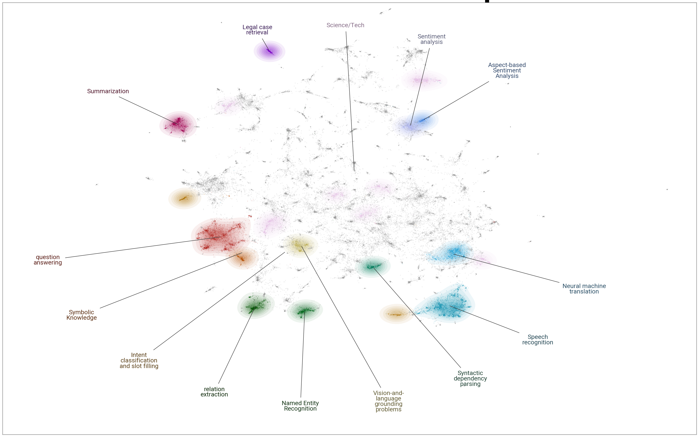

# Combination Encoder Decoder Tranformers to Summarize Documents with Text Clustering and Topic Modeling

<p>
  
</p>

[img source](https://medium.com/@minh.hoque/a-comprehensive-overview-of-transformer-based-models-encoders-decoders-and-more-e9bc0644a4e5)

## Project Description

This project was based off of a tutorial from the book, **[The StatQuest Illustrated Guide to Neural Networks and AI](https://www.amazon.com/dp/B0DRS71QVQ)**

The central ideas expressed in this project are illustrated below.


Taking several documents based on different topics as inputs, I convert the documents into embeddings with an encoder-only transformer. This encoder-only transformer represents a `Representative AI` (i.e., A Respresentation Learner). These are systems that uses "representations" to process and understand data. In my case, the encoder's role is to take the raw data input and transform it into a compressed, lower-dimensional representation also known as a `latent space`. This compressed information preserves the essential information because the encoder learns toe extract the meaningful features from the data. In my case, by encoding, I am clustering the documents based similar themes, topics, and meaning rather than just keywords or neighboring words.

I reduce the dimensions of the embeddings using Uniform Manifold Approximatio and Projection (`UMAP`), a dimensionality reduction techinique used to visualize high-dimensional data into lower dimensional space, while stil preserving the the datas global strcuture and local relationships. It is particularly helpful for revealing patterns and clusters in compelx datasets.

I cluster the documents with the reduced embeddings using the density-based clustering algorithm Hierarchical Density-Based Spatial Clustering of Applications with Noise (`HDBSCAN`). A visualize representation of the number of clusters reduced to 2-dimensions is pictured below.

<p>
  
</p>

HDBSCAN, like DBSCAN, identifies clusters based on the density of data points. Areas with high density of points are considered clusters, spareser areas are either noise or boundaries between clusters. Unlike DBSCAN, HDBSCAN automatically determines the number of clusters and can handle clusters of varying densities. This clustering is accomplished because HBSCAN constructs a hierarchy of clusters and then extracts a stable set of clusters using a density-based measures of stability, like Excess of Mass, to select the most persistent and well-defined clusters. Additionally, it is able to identify and label outliers as noise rather than forcing them into a cluster like DBSCAN.

Next, I use a Decoder-Only LLM, or Generative AI, to give each cluster an excellent title without knowing anything about these documents in advance. It is Generative AI because I am generating new content (here titles) based on learned patterns from existing data. Decoders take compressed representations of data (in this case generated from an encoder) and generate new meaningful output. The job of the decoder is to take abstract data representations and turn them into something understandable.

A Visualization of the Decoder-Only LLM lies below

<p>
  
</p>

Overall, this project is a great example of the power of AI and the ability of transformers to aid in exploratory data analysis and how to deal with vast archives that I otherwise would need help with to form associations.

### My Solution

I build a single Jupyter notebook that constructs an encoder and decoder transformer to semantically group documents and generate titles for those groups.

---

## Objective

The project contains the key elements:

- `Cosine Similarity` used as the distance metric for a UMAP clustering algorithm,
- `Encoder-only`, Large Language model (LLM) or Representative AI, to discover and learn the most useful fetures from documents,
- `Decoder-only`, or Generative AI, to create new titles from encoded representations,
- `Deep Learning` for neural network building,
- `Git` (version control),
- `Hierarchical Density-Based Spatial Clustering of Applications with Noise (HDBSCAN)` for density-based clustering,
- `Hugging Face` to obtain the sentence transformer model to embed text,
- `Jupyter` python coded notebooks,
- `Latent Space`, the lower-dimensional representation of the input data to the encoder,
- `Natural Language Processing (NLP)` to understand, interpret, and manipulate text,
- `Numpy` for array manipulation,
- `Pandas` for dataframe usage,
- `Prompt Engineering` to create new test from Decoder LLM,
- `Python` the standard modules,
- `Sentence- Bidirectional Encoder Representations from Transformers (SBERT)` generate fixed-size sentence embeddings,
- `Transformers`, to manipulate data,
- `Uniform Manifold Approximation and Projection (UMAP)`, a dimensionality reduction technique, and
- `uv` package management including use of `ruff` for linting and formatting

---

## Tech Stack


---

## Getting Started

Here are some instructions to help you set up this project locally.

---

## Installation Steps

The Python version used for this project is `Python 3.12`.

### Clone the Repo

1. Clone the repo (or download it as a zip file):

   ```bash
   git clone https://github.com/beenlanced/combo_encoder_decoder_transformer.git
   ```

2. Create a virtual environment named `.venv` using `uv` Python version 3.12:

   ```bash
   uv venv --python=3.12
   ```

3. Activate the virtual environment: `.venv`

   On macOs and Linux:

   ```bash
   source .venv/bin/activate #mac
   ```

   On Windows:

   ```bash
    # In cmd.exe
    venv\Scripts\activate.bat
   ```

4. Install packages using `pyproject.toml` or (see special notes section)

   ```bash
   uv pip install -r pyproject.toml
   ```

### Install the Jupyter Notebook(s)

1. **Run the Project**

   - Run the Jupyter Notebook(s) in the Jupyter UI or in VS Code.

---

## Data

I use a [subset](https://huggingface.co/datasets/MaartenGr/arxiv_nlp) of the [arXiv Dataset](https://www.kaggle.com/datasets/Cornell-University/arxiv) that was created by [Maarten Grootendorst](https://www.linkedin.com/in/mgrootendorst/) specifically for the _[Hands-On Large Language Models](https://www.oreilly.com/library/view/hands-on-large-language/9781098150952/)_ book. The dataset contains 44,949 abstracts published between 1991 and 2024 from ArXiv’s Computation and Language section, aka cs.CL.

---

## Special Notes

- I use the open-source (read FREE) pre-traind SBERT model: [gte-small model](https://huggingface.co/thenlper/gte-small) from Hugging Face. This transformer model converts the abstracts into embeddings.

- I use the open-source (read FREE) [Flan-t5-small](https://huggingface.co/docs/transformers/model_doc/flan-t5) LLM. It is a smaller, efficient version of the FLAN-T5 large language model, developed by Google. It's a fine-tuned version of the T5 (Text-to-Text Transfer Transformer) model, specifically designed for various natural language processing (NLP) tasks. It excels in zero-shot, few-shot, and chain-of-thought learning scenarios.

---

### Final Words

Thanks for visiting.

Give the project a star (⭐) if you liked it or if it was helpful to you!

You've `beenlanced`! 😉

---

## Acknowledgements

I would like to extend my gratitude to all the individuals and organizations who helped in the development and success of this project. Your support, whether through contributions, inspiration, or encouragement, have been invaluable. Thank you.

Specifically, I would like to acknowledge:

- [Joshua Starmer - StatQuest](https://youtu.be/YCzL96nL7j0). This project was based off of his `Illustrated Guide to Neural Networks and AI course`, particularly chapter 14's `Encoder-Only Transformers` which itelf is heavily based on the tutorial in Chapter 5 of _[Hands-On Large Language Models](https://www.oreilly.com/library/view/hands-on-large-language/9781098150952/)_ by [Jay Alammar](https://www.linkedin.com/in/jalammar/) and [Maarten Grootendorst](https://www.linkedin.com/in/mgrootendorst/). Thanks!

- [Hema Kalyan Murapaka](https://www.linkedin.com/in/hemakalyan) and [Benito Martin](https://martindatasol.com/blog) for sharing their README.md templates upon which I have derieved my README.md.

- The folks at Astral for their UV [documentation](https://docs.astral.sh/uv/)

---

## License

This project is licensed under the MIT License - see the [LICENSE](./LICENSE) file for details
